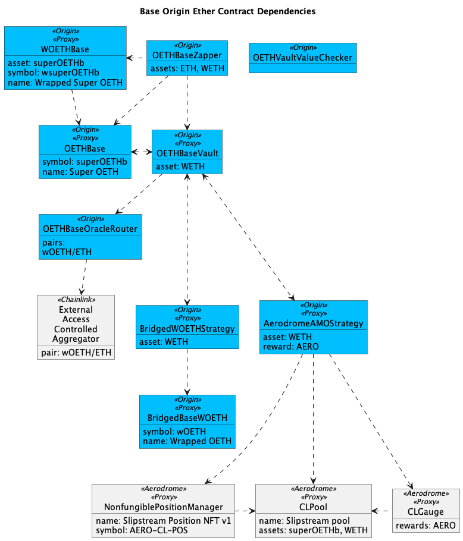

<figure><figcaption></figcaption></figure>

<table><thead><tr><th width="288.11328125">Contract</th><th>Address</th></tr></thead><tbody><tr><td>Super OETH (ERC-20)</td><td><a href="https://basescan.org/address/0xdbfefd2e8460a6ee4955a68582f85708baea60a3#code">0xDBFeFD2e8460a6Ee4955A68582F85708BAEA60A3</a></td></tr><tr><td>Wrapped Super OETH (ERC-4626)</td><td><a href="https://basescan.org/address/0x7fcd174e80f264448ebee8c88a7c4476aaf58ea6#code">0x7FcD174E80f264448ebeE8c88a7C4476AAF58Ea6</a></td></tr><tr><td>Vault</td><td><a href="https://basescan.org/address/0x98a0CbeF61bD2D21435f433bE4CD42B56B38CC93">0x98a0CbeF61bD2D21435f433bE4CD42B56B38CC93</a></td></tr><tr><td>Harvester</td><td><a href="http://basescan.org/address/0x0CbEAcf86232fC04050cD679d860516F7254c22E">0x0CbEAcf86232fC04050cD679d860516F7254c22E</a></td></tr><tr><td>Dripper</td><td><a href="https://basescan.org/address/0x02f2C609950E90934ce99e58b4d7326aD0d7f8d6#code">0x02f2C609950E90934ce99e58b4d7326aD0d7f8d6</a></td></tr><tr><td>Vault Value Checker</td><td><a href="https://basescan.org/address/0x9D98Cf85B65Fa1ACef5e9AAA2300753aDF7bcf6A#code">0x9D98Cf85B65Fa1ACef5e9AAA2300753aDF7bcf6A</a></td></tr><tr><td>Bridged wOETH (ERC-20)</td><td><a href="https://basescan.org/address/0xd8724322f44e5c58d7a815f542036fb17dbbf839">0xD8724322f44E5c58D7A815F542036fb17DbbF839</a></td></tr><tr><td>Bridged wOETH Strategy</td><td><a href="https://basescan.org/address/0x80c864704DD06C3693ed5179190786EE38ACf835">0x80c864704DD06C3693ed5179190786EE38ACf835</a></td></tr><tr><td>Aerodrome AMO Strategy</td><td><a href="https://basescan.org/address/0xF611cC500eEE7E4e4763A05FE623E2363c86d2Af">0xF611cC500eEE7E4e4763A05FE623E2363c86d2Af</a></td></tr><tr><td>Curve AMO Strategy</td><td><a href="https://basescan.org/address/0x9cfcaf81600155e01c63e4d2993a8a81a8205829#code">0x9cfcAF81600155e01c63e4D2993A8A81A8205829</a></td></tr><tr><td>Oracle Router</td><td><a href="https://basescan.org/address/0xbc80dA22601EAe8720ed8AB117EB88c92b97C75b">0xbc80dA22601EAe8720ed8AB117EB88c92b97C75b</a></td></tr><tr><td>Zapper</td><td><a href="https://basescan.org/address/0x3b56c09543D3068f8488ED34e6F383c3854d2bC1">0x3b56c09543D3068f8488ED34e6F383c3854d2bC1</a></td></tr><tr><td>Timelock</td><td><a href="https://basescan.org/address/0xf817cb3092179083c48c014688d98b72fb61464f">0xf817cb3092179083c48c014688d98b72fb61464f</a></td></tr></tbody></table>
