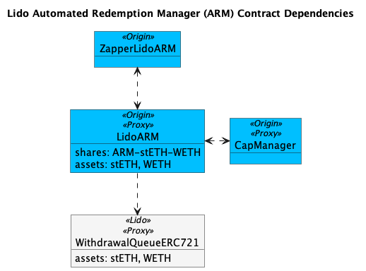

# ARM Registry

<figure><figcaption>
Contract Dependencies
</figcaption></figure>

#### Ethereum

<table><thead><tr><th width="223">Redemption Pair</th><th>Address</th></tr></thead><tbody><tr><td><a href="https://app.1inch.io/#/1/advanced/swap/stETH/ETH">stETH / WETH</a></td><td><a href="https://etherscan.io/address/0x85b78aca6deae198fbf201c82daf6ca21942acc6#code">0x85B78AcA6Deae198fBF201c82DAF6Ca21942acc6</a></td></tr><tr><td><a href="https://app.1inch.io/#/1/advanced/swap/OETH/WETH">OETH / WETH</a></td><td><a href="https://etherscan.io/address/0x6bac785889a4127db0e0cefee88e0a9f1aaf3cc7#code">0x6bac785889A4127dB0e0CeFEE88E0a9F1Aaf3cC7</a></td></tr></tbody></table>

Supporting Contracts

<table><thead><tr><th width="223">Contract</th><th>Address</th></tr></thead><tbody><tr><td>ARM Buyback</td><td><a href="https://etherscan.io/address/0xBa0E6d6ea72cDc0D6f9fCdcc04147c671BA83dB5">0xBa0E6d6ea72cDc0D6f9fCdcc04147c671BA83dB5</a></td></tr><tr><td>Cap Manager</td><td><a href="https://etherscan.io/address/0xf54ebff575f699d281645c6F14Fe427dFFE629CF">0xf54ebff575f699d281645c6F14Fe427dFFE629CF</a></td></tr><tr><td>Lido ARM Zapper</td><td><a href="https://etherscan.io/address/0x01F30B7358Ba51f637d1aa05D9b4A60f76DAD680">0x01F30B7358Ba51f637d1aa05D9b4A60f76DAD680</a></td></tr></tbody></table>

Third Party Contracts

<table><thead><tr><th width="223">Contract</th><th>Address</th></tr></thead><tbody><tr><td>Lido Withdrawal Queue</td><td><a href="https://etherscan.io/address/0x889edC2eDab5f40e902b864aD4d7AdE8E412F9B1">0x889edC2eDab5f40e902b864aD4d7AdE8E412F9B1</a></td></tr></tbody></table>

