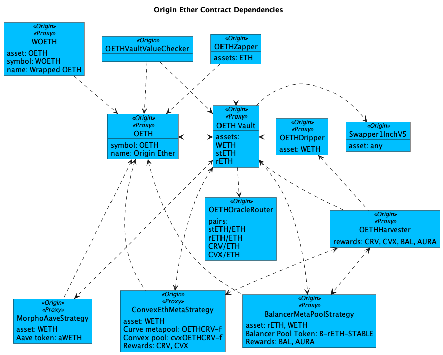

# OETH Registry

Most of Origin's contracts are upgradable via a well-known proxy wrapper and an implementation contract. The Vault is split into VaultAdmin and VaultCore to work around the maximum contract size limit on Ethereum.

<figure><figcaption>
OETH Contract Dependencies
</figcaption></figure>

#### Ethereum

<table><thead><tr><th width="288">Contract</th><th>Address</th></tr></thead><tbody><tr><td>Origin Ether (ERC-20)</td><td><a href="https://etherscan.io/address/0x856c4Efb76C1D1AE02e20CEB03A2A6a08b0b8dC3#code">0x856c4Efb76C1D1AE02e20CEB03A2A6a08b0b8dC3</a></td></tr><tr><td>Wrapped OETH (ERC-4626)</td><td><a href="https://etherscan.io/address/0xdcee70654261af21c44c093c300ed3bb97b78192#code">0xDcEe70654261AF21C44c093C300eD3Bb97b78192</a></td></tr><tr><td>Vault Proxy</td><td><a href="https://etherscan.io/address/0x39254033945AA2E4809Cc2977E7087BEE48bd7Ab#code">0x39254033945AA2E4809Cc2977E7087BEE48bd7Ab</a></td></tr><tr><td>Vault Admin</td><td><a href="https://etherscan.io/address/0x0Bb9C9496e2294A89efF3c8A25ba9730BdED4B8C#code">0x0Bb9C9496e2294A89efF3c8A25ba9730BdED4B8C</a></td></tr><tr><td>Vault Core</td><td><a href="https://etherscan.io/address/0x8f371d8e65f35914cdb8dd58b997411871dabb37#code">0x8f371d8e65F35914CDb8Dd58B997411871dABb37</a></td></tr><tr><td>Zapper</td><td><a href="https://etherscan.io/address/0x9858e47BCbBe6fBAC040519B02d7cd4B2C470C66#code">0x9858e47BCbBe6fBAC040519B02d7cd4B2C470C66</a></td></tr><tr><td>Havester</td><td><a href="https://etherscan.io/address/0x0d017afa83eace9f10a8ec5b6e13941664a6785c#code">0x0D017aFA83EAce9F10A8EC5B6E13941664A6785C</a></td></tr><tr><td>Dripper</td><td><a href="https://etherscan.io/address/0xc0F42F73b8f01849a2DD99753524d4ba14317EB3#code">0xc0F42F73b8f01849a2DD99753524d4ba14317EB3</a></td></tr><tr><td>Buyback</td><td><a href="https://etherscan.io/address/0xFD6c58850caCF9cCF6e8Aee479BFb4Df14a362D2#code">0xFD6c58850caCF9cCF6e8Aee479BFb4Df14a362D2</a></td></tr><tr><td>Oracle Router</td><td><a href="https://etherscan.io/address/0x468a68da3cefcdd644ce0ea9b9564b246218aeec#code">0x468A68da3cefcDD644ce0Ea9B9564b246218aeeC</a></td></tr><tr><td>Convex ETH+OETH (AMO)</td><td><a href="https://etherscan.io/address/0x1827f9ea98e0bf96550b2fc20f7233277fcd7e63#code">0x1827F9eA98E0bf96550b2FC20F7233277FcD7E63</a></td></tr><tr><td>Aura rETH+WETH Strategy</td><td><a href="https://etherscan.io/address/0x49109629ac1deb03f2e9b2fe2ac4a623e0e7dfdc#code">0x49109629aC1deB03F2e9b2fe2aC4a623E0e7dfDC</a></td></tr><tr><td>OETH / ETH Price Feed (Chainlink Oracle)</td><td><a href="https://etherscan.io/address/0x703118C4CbccCBF2AB31913e0f8075fbbb15f563#code">0x703118C4CbccCBF2AB31913e0f8075fbbb15f563</a></td></tr></tbody></table>

The following Chainlink oracles are used to protect the vault in case a backing asset loses value. They also offer slippage protection when harvesting rewards tokens.

<table><thead><tr><th width="290">Pair</th><th>Address</th></tr></thead><tbody><tr><td><a href="https://data.chain.link/ethereum/mainnet/crypto-eth/steth-eth">stETH/ETH</a></td><td><a href="https://etherscan.io/address/0x86392dc19c0b719886221c78ab11eb8cf5c52812#code">0x86392dC19c0b719886221c78AB11eb8Cf5c52812</a></td></tr><tr><td><a href="https://data.chain.link/ethereum/mainnet/crypto-eth/reth-eth">rETH/ETH</a></td><td><a href="https://etherscan.io/address/0x536218f9e9eb48863970252233c8f271f554c2d0#code">0x536218f9E9Eb48863970252233c8F271f554C2d0</a></td></tr><tr><td><a href="https://data.chain.link/ethereum/mainnet/crypto-eth/crv-eth">CRV/ETH</a></td><td><a href="https://etherscan.io/address/0x8a12be339b0cd1829b91adc01977caa5e9ac121e#code">0x8a12Be339B0cD1829b91Adc01977caa5E9ac121e</a></td></tr><tr><td><a href="https://data.chain.link/ethereum/mainnet/crypto-eth/cvx-eth">CVX/ETH</a></td><td><a href="https://etherscan.io/address/0xc9cbf687f43176b302f03f5e58470b77d07c61c6#code">0xC9CbF687f43176B302F03f5e58470b77D07c61c6</a></td></tr><tr><td><a href="https://data.chain.link/ethereum/mainnet/crypto-eth/bal-eth">BAL/ETH</a></td><td><a href="https://etherscan.io/address/0xc1438aa3823a6ba0c159cfa8d98df5a994ba120b#code">0xC1438AA3823A6Ba0C159CfA8D98dF5A994bA120b</a></td></tr></tbody></table>

The AURA/ETH price comes from Origin's `AuraWETHPriceFeed` contract, which uses the Balancer 80 AURA, 20 WETH pool to get a time weighted average price (TWAP). The TWAP used is the latest AURA/WETH price with a five-minute interval. This is cross checked with the one hour interval price from five minutes earlier. If the two TWAPs are more than 2% out, the price is rejected.

<table><thead><tr><th width="291">Contract</th><th>Address</th></tr></thead><tbody><tr><td>AuraWETHPriceFeed</td><td><a href="https://etherscan.io/address/0x94e16bC08d7CCd7f2999Eb5eA3f35DD1EDCBd15B#code">0x94e16bC08d7CCd7f2999Eb5eA3f35DD1EDCBd15B</a></td></tr><tr><td>Balancer 80 Aura 20 WETH Pool</td><td><a href="https://etherscan.io/address/0xc29562b045D80fD77c69Bec09541F5c16fe20d9d#code">0xc29562b045D80fD77c69Bec09541F5c16fe20d9d</a></td></tr></tbody></table>

#### Arbitrum

<table><thead><tr><th width="292">Contract</th><th>Address</th></tr></thead><tbody><tr><td>wOETH (ERC-20)</td><td><a href="https://arbiscan.io/address/0xd8724322f44e5c58d7a815f542036fb17dbbf839#code">0xd8724322f44e5c58d7a815f542036fb17dbbf839</a></td></tr><tr><td>OETH / wOETH Exchange Rate (Chainlink Oracle)</td><td><a href="https://arbiscan.io/address/0x03a1f4b19aaeA6e68f0f104dc4346dA3E942cC45#code">0x03a1f4b19aaeA6e68f0f104dc4346dA3E942cC45</a></td></tr></tbody></table>

#### Base

<table><thead><tr><th width="294">Contract</th><th>Address</th></tr></thead><tbody><tr><td>wOETH (ERC-20)</td><td><a href="https://basescan.org/address/0xd8724322f44e5c58d7a815f542036fb17dbbf839#code">0xD8724322f44E5c58D7A815F542036fb17DbbF839</a></td></tr><tr><td>OETH / wOETH Exchange Rate (Chainlink Oracle)</td><td><a href="https://basescan.org/address/0xe96EB1EDa83d18cbac224233319FA5071464e1b9#code">0xe96EB1EDa83d18cbac224233319FA5071464e1b9</a></td></tr></tbody></table>

#### Optimism

<table><thead><tr><th width="297">Contract</th><th>Address</th></tr></thead><tbody><tr><td>wOETH (ERC-20)</td><td>Coming soon™️</td></tr><tr><td>OETH / wOETH Exchange Rate (Chainlink Oracle)</td><td><a href="https://basescan.org/address/0xe96EB1EDa83d18cbac224233319FA5071464e1b9#code">0x70843CE8E54d2b87Ee02B1911c06EA5632cd07d3</a></td></tr></tbody></table>

#### Deprecated

<table><thead><tr><th width="297">Contract</th><th>Address</th></tr></thead><tbody><tr><td>Governor / Timelock</td><td><a href="https://etherscan.io/address/0x72426BA137DEC62657306b12B1E869d43FeC6eC7#code">0x72426BA137DEC62657306b12B1E869d43FeC6eC7</a></td></tr><tr><td>frxETH Staking Strategy</td><td><a href="https://etherscan.io/address/0x3fF8654D633D4Ea0faE24c52Aec73B4A20D0d0e5#code">0x3fF8654D633D4Ea0faE24c52Aec73B4A20D0d0e5</a></td></tr><tr><td>frxETH Redemption Strategy</td><td><a href="https://etherscan.io/address/0x95A8e45afCfBfEDd4A1d41836ED1897f3Ef40A9e#code">0x95A8e45afCfBfEDd4A1d41836ED1897f3Ef40A9e</a></td></tr></tbody></table>
