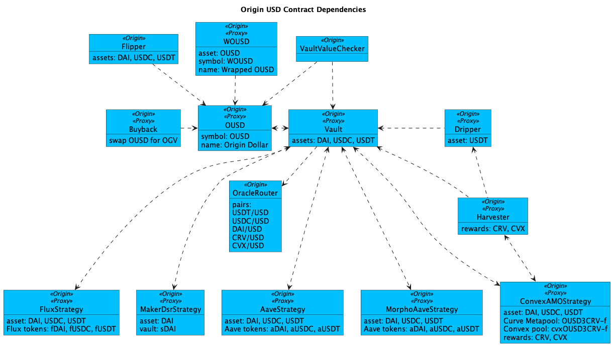

# OUSD Registry

Most of Origin's contracts are upgradable via a well-known proxy wrapper and an implementation contract. The Vault is split into VaultAdmin and VaultCore to work around the maximum contract size limit on Ethereum.

<figure><figcaption>
OUSD Contract Dependencies
</figcaption></figure>

#### Ethereum

<table><thead><tr><th width="258">Contract</th><th>Address</th></tr></thead><tbody><tr><td>Origin Dollar (ERC-20)</td><td><a href="https://etherscan.io/address/0x2a8e1e676ec238d8a992307b495b45b3feaa5e86#code">0x2A8e1E676Ec238d8A992307B495b45B3fEAa5e86</a></td></tr><tr><td>Wrapped OUSD (ERC-4626)</td><td><a href="https://etherscan.io/address/0x33db8d52d65f75e4cdda1b02463760c9561a2aa1#code">0x33db8d52d65F75E4cdDA1b02463760c9561A2aa1</a></td></tr><tr><td>Vault Proxy</td><td><a href="https://etherscan.io/address/0xe75d77b1865ae93c7eaa3040b038d7aa7bc02f70#code">0xE75D77B1865Ae93c7eaa3040B038D7aA7BC02F70</a></td></tr><tr><td>Vault Admin</td><td><a href="https://etherscan.io/address/0x8b39590a49569dd5489e4186b8dd43069d4ef0cc#code">0x8b39590a49569dD5489E4186b8DD43069d4Ef0cC</a></td></tr><tr><td>Vault Core</td><td><a href="https://etherscan.io/address/0x0add23ecf2ef9f4be557c52e75a5bedcdd070d34#code">0x0adD23eCF2Ef9f4be557C52E75A5beDCdD070d34</a></td></tr><tr><td>Harvester</td><td><a href="https://etherscan.io/address/0x21fb5812d70b3396880d30e90d9e5c1202266c89#code">0x21Fb5812D70B3396880D30e90D9e5C1202266c89</a></td></tr><tr><td>Dripper</td><td><a href="https://etherscan.io/address/0x80c898ae5e56f888365e235ceb8cea3eb726cb58#code">0x80c898ae5e56f888365e235ceb8cea3eb726cb58</a></td></tr><tr><td>Buyback</td><td><a href="https://etherscan.io/address/0xd7b28d06365b85933c64e11e639ea0d3bc0e3bab#code">0xD7B28d06365b85933c64E11e639EA0d3bC0e3BaB</a></td></tr><tr><td>Flipper</td><td><a href="https://etherscan.io/address/0xcecad69d7d4ed6d52efcfa028af8732f27e08f70#code">0xcecaD69d7D4Ed6D52eFcFA028aF8732F27e08F70</a></td></tr><tr><td>Convex OUSD+3Crv (AMO)</td><td><a href="https://etherscan.io/address/0x89eb88fedc50fc77ae8a18aad1ca0ac27f777a90#code">0x89Eb88fEdc50FC77ae8a18aAD1cA0ac27f777a90</a></td></tr><tr><td>Aave Strategy</td><td><a href="https://etherscan.io/address/0x5e3646a1db86993f73e6b74a57d8640b69f7e259#code">0x5e3646A1Db86993f73E6b74A57D8640B69F7e259</a></td></tr><tr><td>Morpho Compound Strategy</td><td><a href="https://etherscan.io/address/0x5a4eee58744d1430876d5ca93cab5ccb763c037d#code">0x5A4eEe58744D1430876d5cA93cAB5CcB763C037D</a></td></tr><tr><td>Morpho Aave Strategy</td><td><a href="https://etherscan.io/address/0x79f2188ef9350a1dc11a062cca0abe90684b0197#code">0x79F2188EF9350A1dC11A062cca0abE90684b0197</a></td></tr><tr><td>Flux Strategy</td><td><a href="https://etherscan.io/address/0x76bf500b6305dc4ea851384d3d5502f1c7a0ed44#code">0x76Bf500B6305Dc4ea851384D3d5502f1C7a0ED44</a></td></tr><tr><td>Maker DSR Strategy</td><td><a href="https://etherscan.io/address/0x6b69b755c629590ed59618a2712d8a2957ca98fc#code">0x6b69B755C629590eD59618A2712d8a2957CA98FC</a></td></tr><tr><td>Oracle Router</td><td><a href="https://etherscan.io/address/0xe7fd05515a51509ca373a42e81ae63a40aa4384b#code">0xe7fD05515A51509Ca373a42E81ae63A40AA4384b</a></td></tr></tbody></table>

OUSD is backed by the following collateral assets:

<table data-header-hidden><thead><tr><th width="260">Token</th><th>Address</th></tr></thead><tbody><tr><td><a href="https://etherscan.io/address/0xdac17f958d2ee523a2206206994597c13d831ec7">USDT</a></td><td><a href="https://etherscan.io/address/0xdac17f958d2ee523a2206206994597c13d831ec7#code">0xdac17f958d2ee523a2206206994597c13d831ec7</a></td></tr><tr><td><a href="https://etherscan.io/address/0xa0b86991c6218b36c1d19d4a2e9eb0ce3606eb48">USDC</a></td><td><a href="https://etherscan.io/address/0xa0b86991c6218b36c1d19d4a2e9eb0ce3606eb48#code">0xa0b86991c6218b36c1d19d4a2e9eb0ce3606eb48</a></td></tr><tr><td><a href="https://etherscan.io/address/0x6b175474e89094c44da98b954eedeac495271d0f">DAI</a></td><td><a href="https://etherscan.io/address/0x6b175474e89094c44da98b954eedeac495271d0f#code">0x6b175474e89094c44da98b954eedeac495271d0f</a></td></tr></tbody></table>

The following Chainlink oracles protect the vault if a backing asset loses value. They also offer slippage protection when harvesting rewards tokens.

<table><thead><tr><th width="260">Pair</th><th>Address</th></tr></thead><tbody><tr><td><a href="https://data.chain.link/ethereum/mainnet/stablecoins/usdt-usd">USDT/USD</a></td><td><a href="https://etherscan.io/address/0x3e7d1eab13ad0104d2750b8863b489d65364e32d#code">0x3E7d1eAB13ad0104d2750B8863b489D65364e32D</a></td></tr><tr><td><a href="https://data.chain.link/ethereum/mainnet/stablecoins/usdc-usd">USDC/USD</a></td><td><a href="https://etherscan.io/address/0x8fffffd4afb6115b954bd326cbe7b4ba576818f6#code">0x8fFfFfd4AfB6115b954Bd326cbe7B4BA576818f6</a></td></tr><tr><td><a href="https://data.chain.link/ethereum/mainnet/stablecoins/dai-usd">DAI/USD</a></td><td><a href="https://etherscan.io/address/0xaed0c38402a5d19df6e4c03f4e2dced6e29c1ee9#code">0xAed0c38402a5d19df6E4c03F4E2DceD6e29c1ee9</a></td></tr><tr><td><a href="https://data.chain.link/ethereum/mainnet/crypto-usd/comp-usd">COMP/USD</a></td><td><a href="https://etherscan.io/address/0xdbd020caef83efd542f4de03e3cf0c28a4428bd5#code">0xdbd020CAeF83eFd542f4De03e3cF0C28A4428bd5</a></td></tr><tr><td><a href="https://data.chain.link/ethereum/mainnet/crypto-usd/aave-usd">AAVE/USD</a></td><td><a href="https://etherscan.io/address/0x547a514d5e3769680ce22b2361c10ea13619e8a9#code">0x547a514d5e3769680Ce22B2361c10Ea13619e8a9</a></td></tr><tr><td><a href="https://data.chain.link/ethereum/mainnet/crypto-usd/crv-usd">CRV/USD</a></td><td><a href="https://etherscan.io/address/0xcd627aa160a6fa45eb793d19ef54f5062f20f33f#code">0xCd627aA160A6fA45Eb793D19Ef54f5062F20f33f</a></td></tr><tr><td><a href="https://data.chain.link/ethereum/mainnet/crypto-usd/cvx-usd">CVX/USD</a></td><td><a href="https://etherscan.io/address/0xd962fc30a72a84ce50161031391756bf2876af5d#code">0xd962fC30A72A84cE50161031391756Bf2876Af5D</a></td></tr></tbody></table>

#### Deprecated

<table><thead><tr><th width="259">Contract</th><th>Address</th></tr></thead><tbody><tr><td>Original OGN Staking</td><td><a href="https://etherscan.io/address/0x501804b374ef06fa9c427476147ac09f1551b9a0#code">0x501804B374EF06fa9C427476147ac09F1551B9A0</a></td></tr><tr><td>Original OGN Staking Implementation</td><td><a href="https://etherscan.io/address/0x8cd68a1e0b79150455c5498882d5d5d3df2dde08#code">0x8cD68A1E0b79150455C5498882d5d5D3DF2DdE08</a></td></tr><tr><td>OUSD Compensation</td><td><a href="https://etherscan.io/address/0x9c94df9d594ba1eb94430c006c269c314b1a8281#code">0x9C94df9d594BA1eb94430C006c269C314B1A8281</a></td></tr><tr><td>Old OUSD Vault</td><td><a href="https://etherscan.io/address/0x277e80f3e14e7fb3fc40a9d6184088e0241034bd#code">0x277e80f3E14E7fB3fc40A9d6184088e0241034bD</a></td></tr><tr><td>Old Buyback (1 of 2)</td><td><a href="https://etherscan.io/address/0x77314eb392b2be47c014cde0706908b3307ad6a9#code">0x77314EB392b2be47C014cde0706908b3307Ad6a9</a></td></tr><tr><td>Old Buyback (2 of 2)</td><td><a href="https://etherscan.io/address/0x6c5cdfb47150efc52072cb93eea1e0f123529748#code">0x6C5cdfB47150EFc52072cB93Eea1e0F123529748</a></td></tr><tr><td>Compound Strategy</td><td><a href="https://etherscan.io/address/0x9c459eeb3fa179a40329b81c1635525e9a0ef094#code">0x9c459eeb3FA179a40329b81C1635525e9A0Ef094</a></td></tr><tr><td>Convex DAI+USDC+USDT Strategy</td><td><a href="https://etherscan.io/address/0xea2ef2e2e5a749d4a66b41db9ad85a38aa264cb3#code">0xEA2Ef2e2E5A749D4A66b41Db9aD85a38Aa264cb3</a></td></tr><tr><td>Convex LUSD+3Crv Strategy</td><td><a href="https://etherscan.io/address/0x7a192dd9cc4ea9bdedec9992df74f1da55e60a19#code">0x7A192DD9Cc4Ea9bdEdeC9992df74F1DA55e60a19</a></td></tr></tbody></table>
