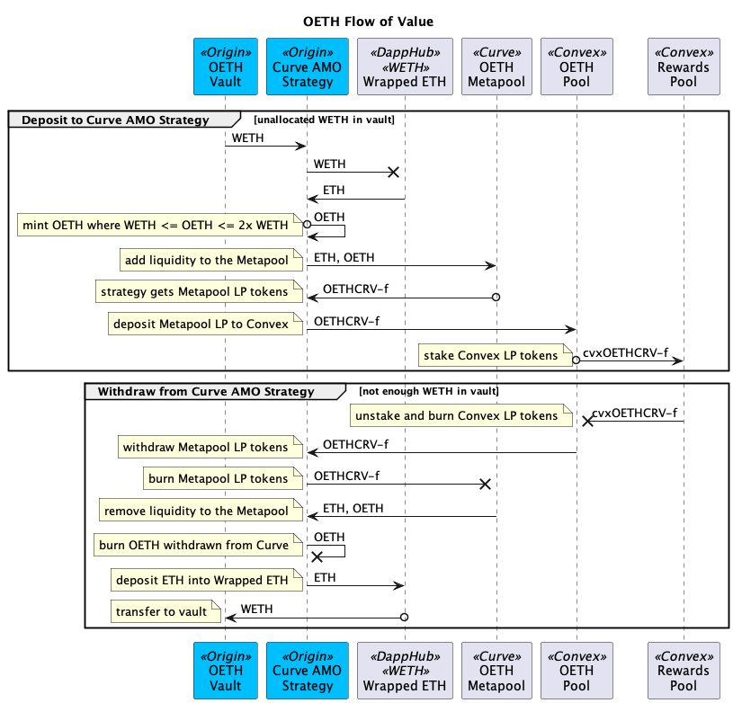

# AMO

OETH, Super OETH, and OUSD all utilize Automated Market Operations (AMO). The AMO helps to maintain the peg, increases capital efficiency, and maximizes yield for OETH, Super OETH and OUSD holders. The AMO is allowed to enact monetary policy within a closed system so long as it does not negatively impact the peg. The protocol remains 100% collateralized at all times even as the money supply programmatically expands and contracts in response to market conditions.


The AMO helps to maintain the peg, increases capital efficiency, and maximizes yield for OETH, Super OETH, and OUSD holders.&#x20;


**Understanding Curve's MetaPool**

MetaPools are Curve pools that allow for one token to trade with another underlying base pool. 3Pool is the most common base pool and it is the only one currently supported by OUSD's strategy codebase. For example, a TUSD MetaPool using 3Pool as its base pool enables users to seamlessly trade between TUSD and 3CRV (DAI/USDC/USDT).

Having 3Pool as a base pool is helpful in multiple ways:

* Prevents diluting existing pools
* Allows Curve to list less liquid assets
* More volume and more trading fees for the DAO

MetaPool liquidity providers can then deposit the LP tokens to the Convex gauge to earn boosted CRV and CVX rewards.

OUSD uses a MetaPool to pair OUSD with 3CRV (USDT/DAI/USDC). OETH uses a standard v2 pool to pair OETH with ETH. Super OETH uses a concentrated liquidity pool on Aerodrome.

<figure><figcaption></figcaption></figure>

**How the AMO Works**

AMMs count the number of coins on each side of the pool to determine the current price. In order to maintain the peg, both sides of a Curve pool must remain balanced. When the protocol deposits funds into a Curve pool, it deploys liquidity to both sides of the pool. For OUSD, it deploys OUSD on one side and 3CRV (USDT/DAI/USDC) on the other. For OETH, it deploys OETH on one side and ETH on the other. This ensures that after deploying liquidity, the balance of the pool doesn't change. There are additional constraints in place that ensure the exchange rate in the pool does not deviate beyond a narrow threshold (0.0001% in the case of Super OETH). When the pool contains more 3CRV than OUSD, the protocol deploys extra OUSD to bring the pool back into balance. Similarly, the protocol can deploy extra OETH if there is more ETH than OETH in the pool. This approach of providing up to double the liquidity to the Curve pools allows the protocol to earn up to twice as many rewards using the same amount of capital. &#x20;

The AMO strategy collects and sells CRV and CVX tokens and the resulting collateral (USDT for OUSD, WETH for OETH) are added to the vault and cause every token holder's balance to increase automatically. In the case of Super OETH, AERO tokens are treated in a similar manner.

This feature can also also work in reverse, with the protocol removing extra OUSD, OETH or Super OETH from the pool when necessary to maintain the stability of the price. The AMO ensures the stability of the peg with far greater capital efficiency than previous models such as Maker's PSM which requires billions of dollars of USDC to be locked up as a stability mechanism for DAI.

#### Protocol Owned Liquidity

Remaining 100% collateralized is an important bedrock component of the protocol. The OUSD, OETH, and Super OETH held by the AMO are controlled by the protocol and they never enter circulation without being collateralized. When traders add or remove OETH from the Curve pool, it has an effect similar to redeeming or minting since our strategy is capable of burning or creating new supply to maintain the pool's balance. Ultimately, OUSD and OETH can still be redeemed at any time for the underlying collateral on a 1:1 basis. Similarly, Super OETH can be exchanged for WETH via the Aerodome pool.

It may sound counterintuitive that the protocol can remain fully collateralized even while deploying unbacked collateral into the pool. Let's look at an example to understand how this is possible. Let's say 1,000 OETH/ETH has been deployed into the Curve pool by the AMO. This means the protocol owns 500 ETH and 500 unbacked OETH. A user comes along and swaps 100 ETH for 99.9 OETH. Notice that they receive slightly fewer units of OETH because of trading fees and slippage. At the end of this transaction, the user is holding 99.9 OETH and the protocol is holding 600.1 ETH and 400 unbacked OETH. Since the user must transfer their ETH to the Curve pool in order to withdraw OETH, the previously unbacked OETH immediately becomes backed as part of the transaction. You can think of it as the vault pre-minting some OETH for Curve to sell on its behalf with those tokens become 100% backed the minute they enter circulation. The extra .1 ETH is owned by the liquidity provider (aka the protocol) and is distributed to holders as extra profit.&#x20;

This model has been extensively tested and demonstrated to work safely at scale. In addition, the Origin team has also completed extensive testing in forked Mainnet node environment simulating how flash loans could mint large amounts, deploy liquidity and then redeem it, manipulating the AMO at various stages of that procedure. No vulnerabilities have been found. For safety, funds are never directly deployed or withdrawn from the AMO as a result of a mint or redeem. Like the rest of the code, the AMO has been thoroughly audited by OpenZeppelin and others.
