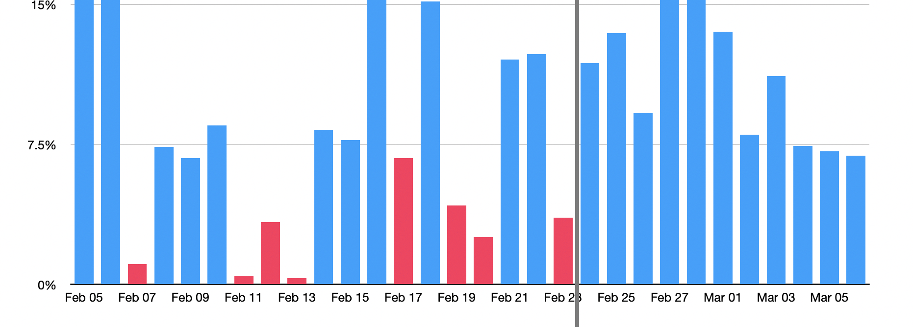

# Dripper

Yield is managed by the Dripper contract and slowly distributed to OETH holders. This smooths out the otherwise choppy yield from the Beacon Chain and bonus reward tokens (e.g. SSV) to improve the user experience and prevent attackers from front-running large yield events.

<figure><figcaption>
Demonstration of yield before and after the Dripper
</figcaption></figure>


The OETH Dripper's duration is currently configured to 604800 (7 days).


### How it works

Here's a demonstration of the flow of funds for OETH:

* Reward tokens (e.g. SSV) are earned by the Beacon Chain staking strategy
* [Someone calls the harvest function](https://docs.oeth.com/guides/incentivized-harvesting-guide) to swap reward tokens for ETH
* ETH proceeds from the harvest are added to the Dripper's balance
* The Dripper gradually allows ETH to be available for distribution to the Vault
* The Vault collects available ETH from the Dripper once per day via Chainlink automation
* The drip rate is updated each time funds are _collected_ (not when they are harvested/added)
* OETH wallets grow due to the increase in the Vault's ETH balance
