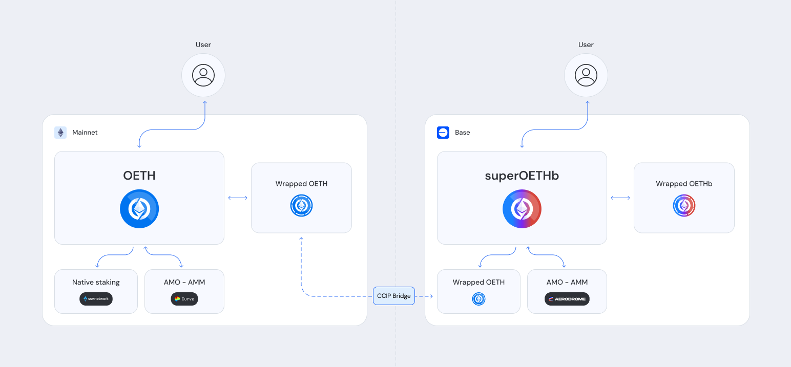

# Super OETH

<figure><figcaption>
Super OETH architecture
</figcaption></figure>

Super OETH is the first in a new class of yield product; supercharged LSTs. By combining liquid staking yield from Ethereum with compounded rewards on layer 2, supercharged LSTs offer materially higher APY compared to traditional LSTs without adding substantial risk of loss. Origin's first token to launch in this category is superOETHb, which derives Beacon Chain yield from bridged Wrapped [OETH](../oeth/) and substantial rewards from Aerodrome through a protocol-owned, concentrated liquidity position on Base.

As a supercharged version of Origin's flagship liquid staking token, Super OETH inherits most of its code from [OETH](../oeth/) and benefits from its multi-year track record of safety and numerous [audits](../../security-and-risk/audits.md). Both products are rebasing ERC-20 tokens that grow automatically in your wallet every day as ETH yield is harvested and auto-compounded.

While Super OETH's staking yield comes from Ethereum via Chainlink's [CCIP](https://chain.link/cross-chain), its peg is ensured by the protocol maintaining a deep liquidity on an Aerodrome pool pairing WETH with superOETHb. This allows for anyone to sell Super OETH 1:1 for WETH at any time. At the same time, the protocol earns AERO incentives, which are harvested back into WETH and distributed to Super OETH holders. This combination of Beacon Chain yield and auto-compounded rewards create a safe and compelling yield token that is fully backed by ETH.
