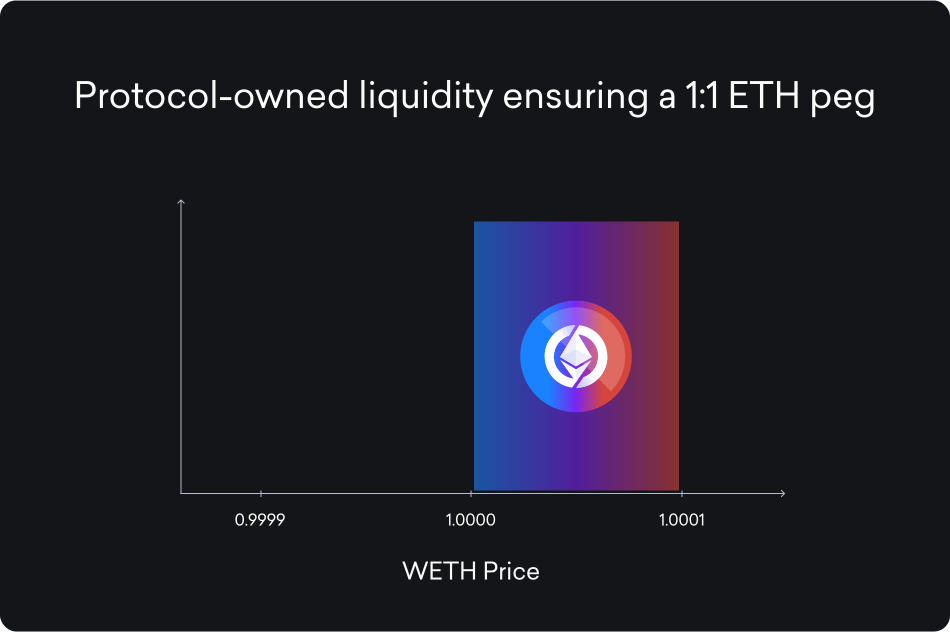

# Protocol-Owned Liquidity

<figure><figcaption></figcaption></figure>

Through its integration with Aerodrome, Super OETH is able to ensure a 1:1 peg with ETH at any scale. The Super OETH [AMO](../../introduction/core-concepts/amo.md) holds a portion of the protocol's underlying collateral in a concentrated liquidity pool with an extremely tight price range within a single tick above 1.0000 WETH. This allows anyone to sell superOETHb into the pool for at least 1 WETH (minus swap fees).

As a result of this large liquidity position, Super OETH earns incentive tokens that are harvested and distributed to superOETHb holders every day in the form of additional superOETHb. Combined with Beacon Chain staking yield from bridged wOETH, these rewards generate a market-leading APY for Super OETH never before seen in a low-risk liquid staking token.
