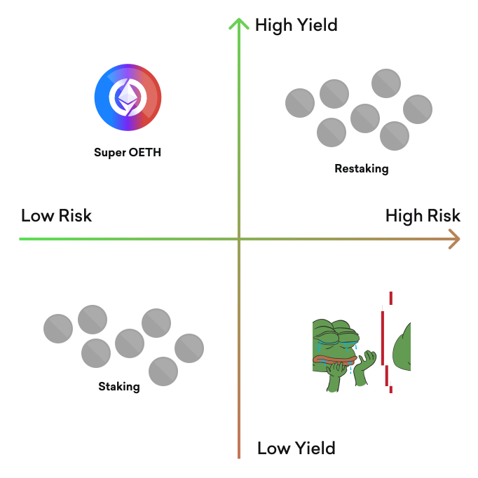

# Supercharged LSTs

<figure><picture><source srcset="../../.gitbook/assets/matrix-dark.svg" media="(prefers-color-scheme: dark)"></picture><figcaption></figcaption></figure>

Super OETH presents a unique combination of low risk and high yield to offer a superior ETH yield product.

Not all LSTs are created equal. Some are more decentralized and some are built by teams with more rigorous security practices than others. Meanwhile, some LSTs offer marginally higher yield but contain hidden costs in the form of exit fees or volatile prices relative to ETH. Super OETH inherits both above-market yield and industry-leading peg stability with OETH as its core building block.

In pursuit of even higher yield, many users have gravitated toward restaking and other strategies that involve taking fundamentally different risk. By adding layers of protocol exposure or leverage, users are  chasing returns that may not actually be better on a risk-adjusted basis. And in many cases, performance is measured in "points" or some other speculative component that requires significant trust and is unlikely to be sustained.

Super OETH aims to offer the best of both worlds. With yield materially higher than vanilla LSTs and a similar risk profile to bridged liquid staking, Super OETH sets itself apart by consistently generating verifiable, compelling, real yield on-chain.
