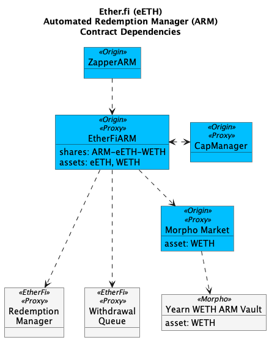

# EtherFi: eETH/WETH


Docs: [https://docs.originprotocol.com/automated-redemption-manager-arm/eeth-arm](https://docs.originprotocol.com/automated-redemption-manager-arm/eeth-arm)


<figure><figcaption></figcaption></figure>

#### ARMs Contracts

<table><thead><tr><th width="230.2109375">Contract</th><th>Address</th></tr></thead><tbody><tr><td>EtherFi ARM </td><td><a href="https://etherscan.io/address/0xfB0A3CF9B019BFd8827443d131b235B3E0FC58d2">0xfB0A3CF9B019BFd8827443d131b235B3E0FC58d2</a></td></tr><tr><td>Morpho Market</td><td><a href="https://etherscan.io/address/0xe776485b4a12d50503af40dbea519671318472ed">0xe776485B4A12d50503aF40DBEa519671318472Ed</a></td></tr><tr><td>Zapper</td><td><a href="https://etherscan.io/address/0xE11EDbd5AE4Fa434Af7f8D7F03Da1742996e7Ab2">0xE11EDbd5AE4Fa434Af7f8D7F03Da1742996e7Ab2</a></td></tr></tbody></table>

#### Third Party Contracts

<table><thead><tr><th width="249.8203125">Contract</th><th>Address</th></tr></thead><tbody><tr><td>EtherFi Redemption Manager</td><td><a href="https://etherscan.io/address/0xDadEf1fFBFeaAB4f68A9fD181395F68b4e4E7Ae0">0xDadEf1fFBFeaAB4f68A9fD181395F68b4e4E7Ae0</a></td></tr><tr><td>EtherFi Withdraw NFT</td><td><a href="https://etherscan.io/address/0x7d5706f6ef3F89B3951E23e557CDFBC3239D4E2c">0x7d5706f6ef3F89B3951E23e557CDFBC3239D4E2c</a></td></tr><tr><td>EtherFi Withdrawal Queue</td><td><a href="https://etherscan.io/address/0x308861A430be4cce5502d0A12724771Fc6DaF216">0x308861A430be4cce5502d0A12724771Fc6DaF216</a></td></tr><tr><td>Morpho Vault: Yearn WETH ARM</td><td><a href="https://etherscan.io/address/0x3Dfe70B05657949A5dB340754aD664810ac63b21">0x3Dfe70B05657949A5dB340754aD664810ac63b21</a></td></tr></tbody></table>

#### Operational Accounts

<table><thead><tr><th width="229.76171875">Contract</th><th>Address</th></tr></thead><tbody><tr><td>Owner</td><td><a href="https://etherscan.io/address/0x35918cDE7233F2dD33fA41ae3Cb6aE0e42E0e69F">0x35918cDE7233F2dD33fA41ae3Cb6aE0e42E0e69F</a></td></tr><tr><td>Operator</td><td><a href="https://etherscan.io/address/0x739212d5bAfE6AAC8Be49a60B7d003bD41DBf38b">0x739212d5bAfE6AAC8Be49a60B7d003bD41DBf38b</a></td></tr><tr><td>Fee Collector</td><td><a href="https://etherscan.io/address/0xBB077E716A5f1F1B63ed5244eBFf5214E50fec8c">0xBB077E716A5f1F1B63ed5244eBFf5214E50fec8c</a></td></tr></tbody></table>

