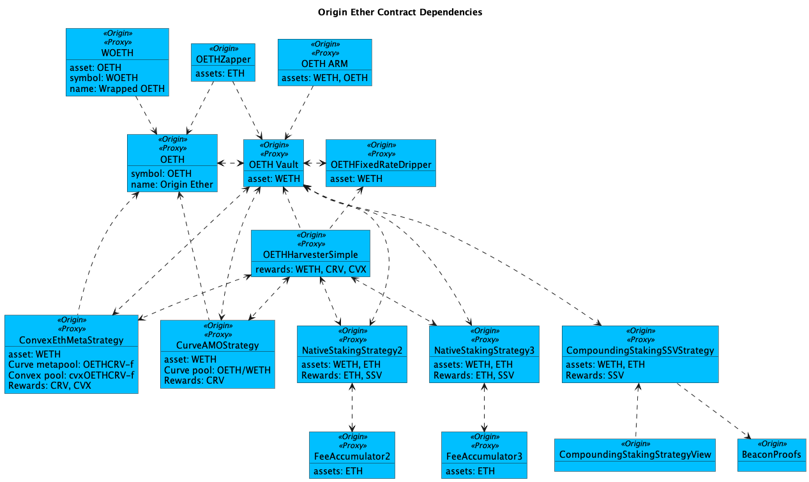

# OETH Registry

Most of Origin's contracts are upgradable via a well-known proxy wrapper and an implementation contract. The Vault is split into VaultAdmin and VaultCore to work around the maximum contract size limit on Ethereum.

<figure><figcaption></figcaption></figure>

#### Ethereum

<table><thead><tr><th width="288">Contract</th><th>Address</th></tr></thead><tbody><tr><td>Origin Ether (ERC-20)</td><td><a href="https://etherscan.io/address/0x856c4Efb76C1D1AE02e20CEB03A2A6a08b0b8dC3#code">0x856c4Efb76C1D1AE02e20CEB03A2A6a08b0b8dC3</a></td></tr><tr><td>Wrapped OETH (ERC-4626)</td><td><a href="https://etherscan.io/address/0xdcee70654261af21c44c093c300ed3bb97b78192#code">0xDcEe70654261AF21C44c093C300eD3Bb97b78192</a></td></tr><tr><td>Vault</td><td><a href="https://etherscan.io/address/0x39254033945AA2E4809Cc2977E7087BEE48bd7Ab#code">0x39254033945AA2E4809Cc2977E7087BEE48bd7Ab</a></td></tr><tr><td>Zapper</td><td><a href="https://etherscan.io/address/0xDA0485c1E74A7ef690E99D8286C243942eDAa07B">0xDA0485c1E74A7ef690E99D8286C243942eDAa07B</a></td></tr><tr><td>Harvester</td><td><a href="https://etherscan.io/address/0x0d017afa83eace9f10a8ec5b6e13941664a6785c#code">0x0D017aFA83EAce9F10A8EC5B6E13941664A6785C</a></td></tr><tr><td>Harvester Simple</td><td><a href="https://etherscan.io/address/0x6D416E576eECBB9F897856a7c86007905274ed04">0x6D416E576eECBB9F897856a7c86007905274ed04</a></td></tr><tr><td>FixedRateDripper</td><td><a href="https://etherscan.io/address/0xe3b3b4fc77505ecfaacf6dd21619a8cc12fcc501">0xe3b3b4fc77505ecfaacf6dd21619a8cc12fcc501</a></td></tr><tr><td>Buyback</td><td><a href="https://etherscan.io/address/0xFD6c58850caCF9cCF6e8Aee479BFb4Df14a362D2#code">0xFD6c58850caCF9cCF6e8Aee479BFb4Df14a362D2</a></td></tr><tr><td>Oracle Router</td><td><a href="https://etherscan.io/address/0x468a68da3cefcdd644ce0ea9b9564b246218aeec#code">0x468A68da3cefcDD644ce0Ea9B9564b246218aeeC</a></td></tr><tr><td>Compounding Staking Strategy</td><td><a href="https://etherscan.io/address/0xaF04828Ed923216c77dC22a2fc8E077FDaDAA87d">0xaF04828Ed923216c77dC22a2fc8E077FDaDAA87d</a></td></tr><tr><td>Compounding Staking Strategy View</td><td><a href="https://etherscan.io/address/0xEDf495F92c2eBdEE8B797E9C503aA7A3302A9c88">0xEDf495F92c2eBdEE8B797E9C503aA7A3302A9c88</a></td></tr><tr><td>BeaconProofs</td><td><a href="https://etherscan.io/address/0xc4444C5D9e7C1a5A0a01c5E4b11692d589DcAF22">0xc4444C5D9e7C1a5A0a01c5E4b11692d589DcAF22</a></td></tr><tr><td>First Native Staking Strategy</td><td><a href="https://etherscan.io/address/0x34edb2ee25751ee67f68a45813b22811687c0238">0x34eDb2ee25751eE67F68A45813B22811687C0238</a></td></tr><tr><td>First Native Staking Fee Accumulator</td><td><a href="https://etherscan.io/address/0x7eD4ccb74A1eE903Af5fBd9be00CA8616F23D627">0x7eD4ccb74A1eE903Af5fBd9be00CA8616F23D627</a></td></tr><tr><td>Second Native Staking Strategy</td><td><a href="https://etherscan.io/address/0x4685db8bf2df743c861d71e6cfb5347222992076">0x4685dB8bF2Df743c861d71E6cFb5347222992076</a></td></tr><tr><td>Second Native Staking Fee Accumulator</td><td><a href="https://etherscan.io/address/0xfEE31c09fA5E9cdbC1f80C90b42B58640be91DDF">0xfEE31c09fA5E9cdbC1f80C90b42B58640be91DDF</a></td></tr><tr><td>Third Native Staking Strategy</td><td><a href="https://etherscan.io/address/0xE98538A0e8C2871C2482e1Be8cC6bd9F8E8fFD63">0xE98538A0e8C2871C2482e1Be8cC6bd9F8E8fFD63</a></td></tr><tr><td>Third Native Staking Fee Accumulator</td><td><a href="https://etherscan.io/address/0x49674fBce040D95366604d1db3392E9bDEa14d48">0x49674fBce040D95366604d1db3392E9bDEa14d48</a></td></tr><tr><td>Convex ETH+OETH (AMO) Strategy</td><td><a href="https://etherscan.io/address/0x1827f9ea98e0bf96550b2fc20f7233277fcd7e63#code">0x1827F9eA98E0bf96550b2FC20F7233277FcD7E63</a></td></tr><tr><td>Curve OETH+WETH (AMO) Strategy</td><td><a href="https://etherscan.io/address/0xba0e352AB5c13861C26e4E773e7a833C3A223FE6#code">0xba0e352AB5c13861C26e4E773e7a833C3A223FE6</a></td></tr><tr><td>OETH / ETH Price Feed (Chainlink Oracle)</td><td><a href="https://etherscan.io/address/0x703118C4CbccCBF2AB31913e0f8075fbbb15f563#code">0x703118C4CbccCBF2AB31913e0f8075fbbb15f563</a></td></tr><tr><td>wOETH LayerZero Adapter</td><td><a href="https://etherscan.io/address/0x7d1bEa5807e6af125826d56ff477745BB89972b8">0x7d1bEa5807e6af125826d56ff477745BB89972b8</a></td></tr><tr><td>PoolBoostCentralRegistry</td><td><a href="https://etherscan.io/address/0xAA8af8Db4B6a827B51786334d26349eb03569731">0xAA8af8Db4B6a827B51786334d26349eb03569731</a></td></tr><tr><td>PoolBoosterFactoryMerkl</td><td><a href="https://etherscan.io/address/0x0FC66355B681503eFeE7741BD848080d809FD6db">0x0FC66355B681503eFeE7741BD848080d809FD6db</a></td></tr></tbody></table>

The following Chainlink oracles are used for slippage protection when harvesting rewards tokens.

<table><thead><tr><th width="290">Pair</th><th>Address</th></tr></thead><tbody><tr><td><a href="https://data.chain.link/ethereum/mainnet/crypto-eth/crv-eth">CRV/ETH</a></td><td><a href="https://etherscan.io/address/0x8a12be339b0cd1829b91adc01977caa5e9ac121e#code">0x8a12Be339B0cD1829b91Adc01977caa5E9ac121e</a></td></tr><tr><td><a href="https://data.chain.link/ethereum/mainnet/crypto-eth/cvx-eth">CVX/ETH</a></td><td><a href="https://etherscan.io/address/0xc9cbf687f43176b302f03f5e58470b77d07c61c6#code">0xC9CbF687f43176B302F03f5e58470b77D07c61c6</a></td></tr></tbody></table>

#### Arbitrum

<table><thead><tr><th width="292">Contract</th><th>Address</th></tr></thead><tbody><tr><td>wOETH (ERC-20)</td><td><a href="https://arbiscan.io/address/0xd8724322f44e5c58d7a815f542036fb17dbbf839#code">0xd8724322f44e5c58d7a815f542036fb17dbbf839</a></td></tr><tr><td>OETH / wOETH Exchange Rate (Chainlink Oracle)</td><td><a href="https://arbiscan.io/address/0x03a1f4b19aaeA6e68f0f104dc4346dA3E942cC45#code">0x03a1f4b19aaeA6e68f0f104dc4346dA3E942cC45</a></td></tr></tbody></table>

#### Base

<table><thead><tr><th width="294">Contract</th><th>Address</th></tr></thead><tbody><tr><td>wOETH (ERC-20)</td><td><a href="https://basescan.org/address/0xd8724322f44e5c58d7a815f542036fb17dbbf839#code">0xD8724322f44E5c58D7A815F542036fb17DbbF839</a></td></tr><tr><td>OETH / wOETH Exchange Rate (Chainlink Oracle)</td><td><a href="https://basescan.org/address/0xe96EB1EDa83d18cbac224233319FA5071464e1b9#code">0xe96EB1EDa83d18cbac224233319FA5071464e1b9</a></td></tr></tbody></table>

#### Plume

<table><thead><tr><th width="294">Contract</th><th>Address</th></tr></thead><tbody><tr><td>wOETH (ERC-20)</td><td><a href="https://phoenix-explorer.plumenetwork.xyz/address/0xD8724322f44E5c58D7A815F542036fb17DbbF839">0xD8724322f44E5c58D7A815F542036fb17DbbF839</a></td></tr><tr><td>OETH / wOETH Exchange Rate (eOracle)</td><td><a href="https://phoenix-explorer.plumenetwork.xyz/address/0x4915600Ed7d85De62011433eEf0BD5399f677e9b?tab=contract">0x4915600Ed7d85De62011433eEf0BD5399f677e9b</a></td></tr><tr><td>wOETH LayerZero Adapter</td><td><a href="https://phoenix-explorer.plumenetwork.xyz/address/0x592CB6A596E7919930bF49a27AdAeCA7C055e4DB">0x592CB6A596E7919930bF49a27AdAeCA7C055e4DB</a></td></tr></tbody></table>

#### Optimism

<table><thead><tr><th width="297">Contract</th><th>Address</th></tr></thead><tbody><tr><td>wOETH (ERC-20)</td><td>Coming soon™️</td></tr><tr><td>OETH / wOETH Exchange Rate (Chainlink Oracle)</td><td><a href="https://basescan.org/address/0xe96EB1EDa83d18cbac224233319FA5071464e1b9#code">0x70843CE8E54d2b87Ee02B1911c06EA5632cd07d3</a></td></tr></tbody></table>

#### Deprecated

<table><thead><tr><th width="297">Contract</th><th>Address</th></tr></thead><tbody><tr><td>Governor / Timelock</td><td><a href="https://etherscan.io/address/0x72426BA137DEC62657306b12B1E869d43FeC6eC7#code">0x72426BA137DEC62657306b12B1E869d43FeC6eC7</a></td></tr><tr><td>frxETH Staking Strategy</td><td><a href="https://etherscan.io/address/0x3fF8654D633D4Ea0faE24c52Aec73B4A20D0d0e5#code">0x3fF8654D633D4Ea0faE24c52Aec73B4A20D0d0e5</a></td></tr><tr><td>frxETH Redemption Strategy</td><td><a href="https://etherscan.io/address/0x95A8e45afCfBfEDd4A1d41836ED1897f3Ef40A9e#code">0x95A8e45afCfBfEDd4A1d41836ED1897f3Ef40A9e</a></td></tr><tr><td>Aura rETH+WETH Strategy</td><td><a href="https://etherscan.io/address/0x49109629ac1deb03f2e9b2fe2ac4a623e0e7dfdc#code">0x49109629aC1deB03F2e9b2fe2aC4a623E0e7dfDC</a></td></tr><tr><td>Morpho Aave V2 WETH Strategy</td><td><a href="https://etherscan.io/address/0xc1fc9e5ec3058921ea5025d703cbe31764756319#code">0xc1fc9e5ec3058921ea5025d703cbe31764756319</a></td></tr><tr><td>Lido Withdrawal Strategy</td><td><a href="https://etherscan.io/address/0xD9B488280d723338Dd32d56b3900f379Eb7A7aF1">0xD9B488280d723338Dd32d56b3900f379Eb7A7aF1</a></td></tr><tr><td>Dripper</td><td><a href="https://etherscan.io/address/0xc0F42F73b8f01849a2DD99753524d4ba14317EB3#code">0xc0F42F73b8f01849a2DD99753524d4ba14317EB3</a></td></tr></tbody></table>
