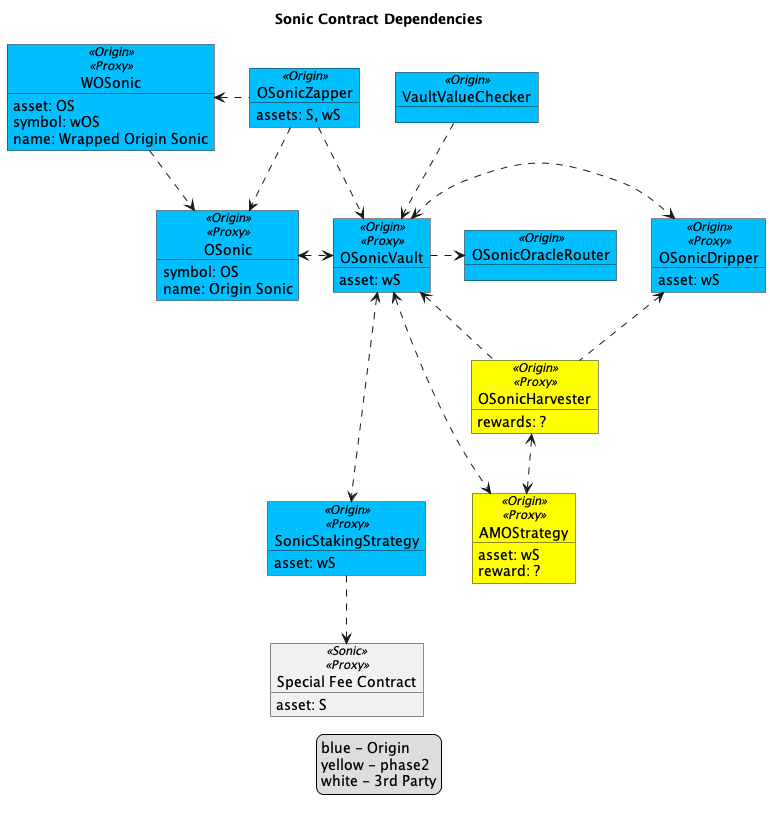

# OS Registry

#### Sonic

<figure><figcaption>
Sonic contract dependencies
</figcaption></figure>

<table><thead><tr><th width="301">Contract</th><th width="466">Address</th></tr></thead><tbody><tr><td>Origin Sonic (ERC-20)</td><td><a href="https://sonicscan.org/address/0xb1e25689D55734FD3ffFc939c4C3Eb52DFf8A794#code">0xb1e25689D55734FD3ffFc939c4C3Eb52DFf8A794</a></td></tr><tr><td>Wrapped OS (ERC-4626)</td><td><a href="https://sonicscan.org/address/0x9F0dF7799f6FDAd409300080cfF680f5A23df4b1#code">0x9F0dF7799f6FDAd409300080cfF680f5A23df4b1</a></td></tr><tr><td>Vault Proxy</td><td><a href="https://sonicscan.org/address/0xa3c0eCA00D2B76b4d1F170b0AB3FdeA16C180186#code">0xa3c0eCA00D2B76b4d1F170b0AB3FdeA16C180186</a></td></tr><tr><td>Vault Admin</td><td><a href="https://sonicscan.org/address/0x4Bc73050916e6D1738286D8863F8FdcFFAA879f8#code">0x4Bc73050916e6D1738286D8863F8FdcFFAA879f8</a></td></tr><tr><td>Vault Core</td><td><a href="https://sonicscan.org/address/0xb3D6e885F0c0f5355C7029AF328fE923EBf9906c#code">0xb3D6e885F0c0f5355C7029AF328fE923EBf9906c</a></td></tr><tr><td>Oracle Router</td><td><a href="https://sonicscan.org/address/0xE68e0C66950a7e02335fc9f44daa05D115c4E88B">0xE68e0C66950a7e02335fc9f44daa05D115c4E88B</a></td></tr><tr><td>Dripper</td><td><a href="https://sonicscan.org/address/0x5b72992e9CDe8C07CE7C8217eB014EC7fD281f03#code">0x5b72992e9CDe8C07CE7C8217eB014EC7fD281f03</a></td></tr><tr><td>Zapper</td><td><a href="https://sonicscan.org/address/0xe25A2B256ffb3AD73678d5e80DE8d2F6022fAb21#code">0xe25A2B256ffb3AD73678d5e80DE8d2F6022fAb21</a></td></tr><tr><td>Sonic Staking Strategy</td><td><a href="https://sonicscan.org/address/0x596B0401479f6DfE1cAF8c12838311FeE742B95c#code">0x596B0401479f6DfE1cAF8c12838311FeE742B95c</a></td></tr><tr><td>Timelock</td><td><a href="https://sonicscan.org/address/0x31a91336414d3b955e494e7d485a6b06b55fc8fb#code">0x31a91336414d3B955E494E7d485a6B06b55FC8fB</a></td></tr><tr><td>VaultValueChecker</td><td><a href="https://sonicscan.org/address/0x06f172e6852085eCa886B7f9fd8f7B21Db3D2c40">0x06f172e6852085eCa886B7f9fd8f7B21Db3D2c40</a></td></tr></tbody></table>

