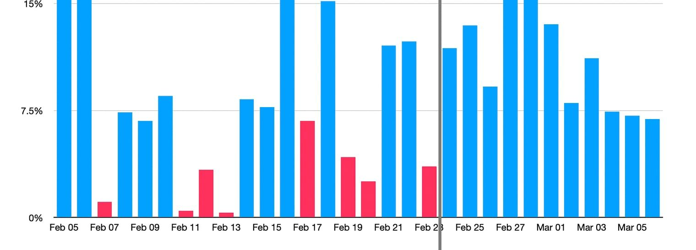

# Yield Smoothing

Origin's yield tokens share a common feature that throttles the distribution of yield over time. This design smooths out what would otherwise be a choppy experience for token holders. It also mitigates the impact of transient yield seekers who might try to front-run large yield events.

<figure><figcaption></figcaption></figure>

The image above depicts yield distribution before and after smoothing was introduced. Rather than distribute yield immediately when it is generated, the vault normalizes this yield rate and rebases the token supply with less volatility.

This smoothing feature is configured by two variables that are managed by the Guardian (2 of 9 Safe) for each yield token:

* `rebasePerSecondMax`
  * A limit on the maximum APR per second that the vault can distribute.
* `dripDuration`
  * The number of seconds over which yield is gradually distributed, assuming that the vault's surplus is replenished at the same rate.

The end result is a yield management system that ensures a fairly consistent distribution of yield during times when yield is abundant and times when it's scarce.
